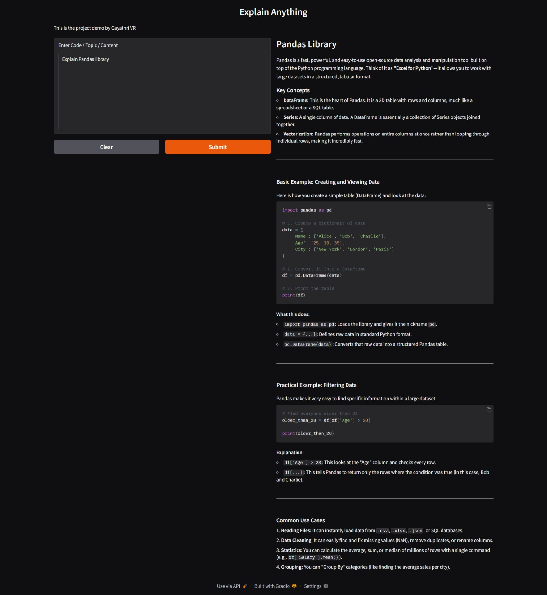

## 🧠 ExplainAnything-AI

An AI-powered web app that explains code, concepts, or any text in a simple and clear way using Gemini and Gradio.

----

## 🚀 Features

Explain code and concepts

Simple and easy-to-use interface

Real-time AI responses

---

## 📸 Demo

## Download and Watch demo video

---

## 🛠️ Tech Stack
Python

Gradio

Gemini API

----

## ⚙️ How It Works

The user enters code, text, or a concept

The input is sent to the backend

The Gemini API processes the request

The AI generates a simple explanation

The output is displayed instantly

---

## 🧩 Technical Implementation

🔹 Architecture
User Input → Gradio UI → Python Backend → Gemini API → Response → UI

---

## ▶️ Run the App

python explain_anything.py

---

## 🔑 Setup API Key

export GOOGLE_API_KEY="your_api_key"

---

## 💡 Future Improvements

🧠 Multiple explanation levels (Beginner / Advanced)

💬 Chat-based interface

📂 File upload support

🎨 Improved UI/UX design

🧪 Code debugging mode

